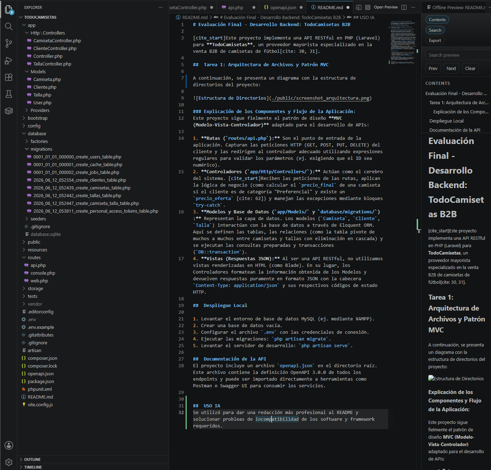

# Evaluación Final - Desarrollo Backend: TodoCamisetas B2B

[cite_start]Este proyecto implementa una API RESTful en PHP (Laravel) para **TodoCamisetas**, un proveedor mayorista especializado en la venta B2B de camisetas de fútbol

##  Tarea 1: Arquitectura de Archivos y Patrón MVC

A continuación, se presenta un diagrama con la estructura de directorios del proyecto:

### Explicación de los Componentes y Flujo de la Aplicación:
Este proyecto sigue fielmente el patrón de diseño **MVC (Modelo-Vista-Controlador)** adaptado para el desarrollo de APIs:

1. **Rutas (`routes/api.php`):** Son el punto de entrada de la aplicación. Capturan las peticiones HTTP (GET, POST, PUT, DELETE) del cliente y las redirigen al controlador adecuado utilizando expresiones regulares para validar los parámetros (ej. exigiendo que el ID sea numérico).
2. **Controladores (`app/Http/Controllers/`):** Actúan como el cerebro del sistema. [cite_start]Reciben las peticiones de las rutas, aplican la lógica de negocio (como calcular el `precio_final` de una camiseta si el cliente es de categoría "Preferencial" y existe un `precio_oferta` ) y manejan las excepciones mediante bloques `try-catch`.
3. **Modelos y Base de Datos (`app/Models/` y `database/migrations/`):** Representan la capa de datos. Los modelos (`Camiseta`, `Cliente`, `Talla`) interactúan con la base de datos a través de Eloquent ORM. Aquí se definen las tablas, las relaciones (como la tabla pivote de muchos a muchos entre camisetas y tallas con eliminación en cascada) y se ejecutan las consultas preparadas y transacciones (`DB::transaction`).
4. **Vistas (Respuestas JSON):** Al ser una API RESTful, no utilizamos vistas renderizadas en HTML (como Blade). En su lugar, los Controladores formatean la información obtenida de los Modelos y devuelven respuestas puramente en formato JSON con la cabecera `Content-Type: application/json` y sus respectivos códigos de estado HTTP.

##  Despliegue Local

1. Levantar el entorno de base de datos MySQL (ej. mediante XAMPP).
2. Crear una base de datos vacía.
3. Configurar el archivo `.env` con las credenciales de conexión.
4. Ejecutar las migraciones: `php artisan migrate`.
5. Levantar el servidor de desarrollo: `php artisan serve`.

##  Documentación de la API
El proyecto incluye un archivo `openapi.json` en el directorio raíz. Este archivo contiene la definición OpenAPI 3.0.0 de todos los endpoints y puede ser importado directamente a herramientas como Postman o Swagger UI para consumir los servicios.

##  USO IA
Se utilizó para dar una redacción más profesional al README y solucionar probleas de incompatibilidad de los software y framework requeridos.
